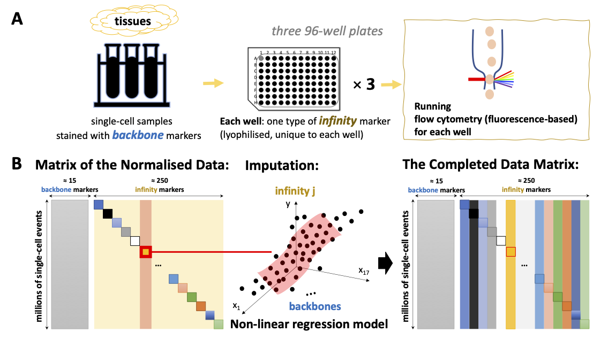
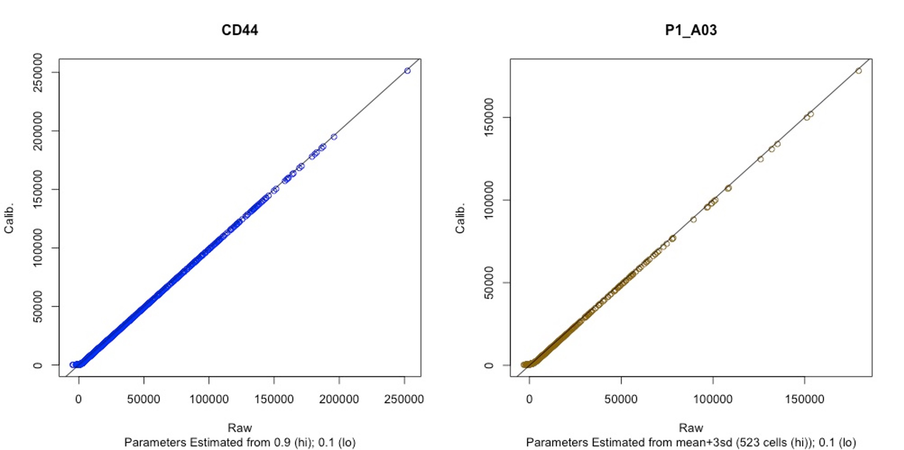
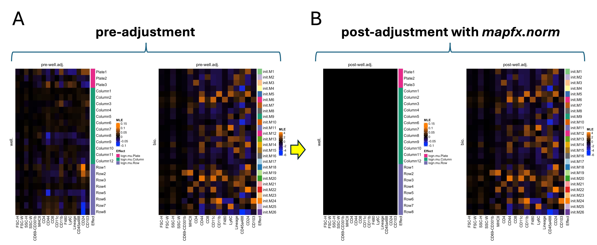
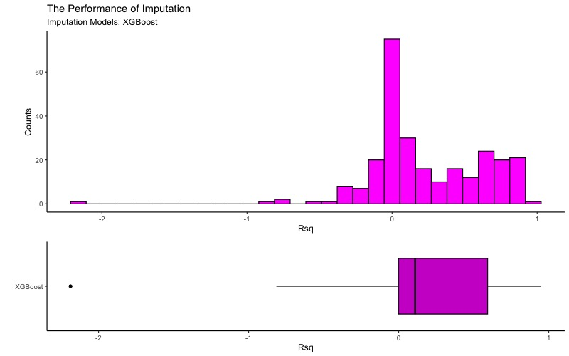
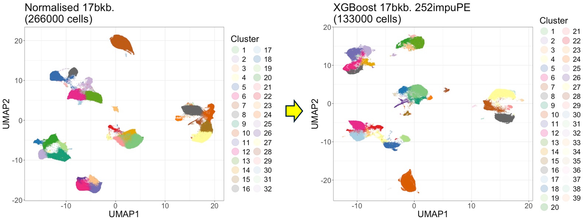

```{r, setup, include=FALSE}
knitr::opts_chunk$set(echo = TRUE)
```

# Introduction
## Motivation
Massively-Parallel Cytometry (MPC) experiments allow cost-effective quantification of more than 200 surface proteins at single-cell resolution. The Inflow protocol [@inflow] is the pioneer of the pipeline for analysing MPC data, and the Bioconductor's `infinityFlow` package was developed for comprehensive analyses. However, the methods for background correction and removal of unwanted variation implemented in the package can be improved. We develop the `MAPFX` package as an alternative that has a more thoughtful strategy to clean up the raw protein intensities. Unique features of our package compared to the `infinityFlow` pipeline include performing background correction prior to imputation and removing unwanted variation from the data at the cell-level, while explicitly accounting for the potential association between biology and unwanted factors. We benchmarked our pipeline against the `infinityFlow` pipeline and demonstrated that our approach is better at preserving biological signals, removing unwanted variation, and imputing unmeasured infinity markers [@mapfx]. Two user friendly functions `MapfxMPC` and `MapfxFFC` are included in the `MAPFX` package that were designed for data from either MPC or FFC experiments (see below sections for details). 

## Experimental and Computational Pipeline of the Data from the Massively-Parallel Cytometry (MPC) Experiments


The experimental and the computational pipeline of the Inflow protocol [@inflow]: (A) Experimental pipeline. The single-cell samples are stained with backbone markers (backbone panel staining), then the stained samples are allocated to wells with one particular infinity marker (infinity panel staining), lastly, data can be acquired from the flow cytometry assay for each well. (B) Computational pipeline. The matrix of the normalised data showing that the backbone matrix (gray) contains values for every single-cell (row), but only block diagonal entries of the infinity matrix (yellow) have measurements. Imputation of the unmeasured infinity markers is done by using the backbone markers as predictors in regression models. Finally, the completed data matrix is obtained after imputation. The above figure is extracted from Figure 1 of the paper by @mapfx.

## Analysing Data from MPC Experiments
This package implemented an end-to-end toolbox for analysing raw data from MPC experiments. More details on the methodology can be found in @mapfx. The `MapfxMPC` function is designed for running through the whole pipeline. The pipeline starts by performing background correction on raw intensities to remove the noise from electronic baseline restoration and fluorescence compensation by adapting a normal-exponential convolution model. Unwanted technical variation, from sources such as well effects, is then removed using a log-normal model with plate, column, and row factors, after which infinity markers are imputed using the informative backbone markers as predictors with machine learning models. Cluster analysis and visualisation with UMAP two-dimensional representations can then be carried out if desired. Users can set `MapfxMPC(..., impute=FALSE)` if the imputation is not needed. 

## Analysing Data from the Fluorescence Flow Cytometry (FFC) Experiments
For the protein intensities from FFC experiments, the function `MapfxFFC` is used to carry out normalisation steps which include background correction and removal of unwanted variation, and the function can further perform cluster analysis and visualisation with UMAP two-dimensional representations if specified.

## Preparing Data for the Analysis - the Folder Diagram
```
# FCSpath
└───FCSpath/FCS
│   └───fcs
│       │   Plate1_A01.fcs
│       │   Plate1_A02.fcs
│       │   ...
│   └───meta
│       │   filename_meta.csv

# Outpath
└───Outpath/Output
│   └───intermediary
│   └───downstream
│   └───graph

## Note: the sub-folders `intermediary`, `downstream`, and `graph` will 
## be generated automatically by MAPFX.
```

### Notes on Metadata
#### For MPC (the plate-based) Experiments
When set `file_meta = "auto"` for `MapfxMPC`, the file identifier keyword (GUID) of the FCS files MUST contain the following information and in the specified format:\
Plate information: Plate1, Plate2, …, Plate9\
Well information: A1, A2, …, A12, B1, …, H1, …, H12\

When set `file_meta = "usr"`, prepare `filename_meta.csv` in the following format and save the CSV file under `FCSpath/FCS/meta/`.\
An example:
```{r, metaformat1, echo = FALSE, results = 'asis'}
library(knitr)
df <- data.frame(
    Filenam = c("p1_a12.fcs", "p2_d08.fcs", "p3_g1.fcs"), #should be the same as the GUID in the FCS files
    Plate = c("Plate1", "Plate2", "Plate3"),
    Well = c("A12", "D08", "G01"),
    Column = c("Col.12", "Col.08", "Col.01"),
    Row = c("Row.01", "Row.04", "Row.07"),
    Well.lab = c("P1_A12", "P2_D08", "P3_G01"))
kable(df)
```
Note that the "Filenam" column refers to the GUID (file name) of each FCS file in the `FCSpath/FCS/fcs/`.


#### For FFC Experiments from Different Batches
Prepare `filename_meta.csv` in the following format and save the CSV file in `FCSpath/FCS/meta/`.\
An example:
```{r, metaformat2, echo = FALSE, results = 'asis'}
library(knitr)
df <- data.frame(
    Filenam = c("090122.fcs", "070122.fcs", "010122.fcs"), #should be the same as the GUID in the FCS files
    Batch = c("Batch1", "Batch2", "Batch3"))
kable(df)
```


# Analysing Data with the MAPFX Package
## Installation
The MAPFX package can be installed using the code below.
```{r, install_mapfx, eval=FALSE}
if (!require("BiocManager", quietly = TRUE))
    install.packages("BiocManager")

BiocManager::install("MAPFX")
```

Along with the MAPFX package, we also load the following packages required for running functions in MAPFX.
```{r, dependency}
library(MAPFX)

## specify the package names
suppressPackageStartupMessages({
library(flowCore)
library(Biobase)
library(stringr)
library(uwot)
library(iCellR)
library(igraph)
library(ggplot2)
library(RColorBrewer)
library(Rfast)
library(ComplexHeatmap)
library(circlize)
library(glmnetUtils)
library(e1071)
library(xgboost)
library(parallel)
library(pbapply)
library(reshape2)
library(gtools)
library(utils)
library(stats)
library(cowplot)
})

```

## Using the Example Datasets in MAPFX Package for this Vignette
### MPC
This dataset is a subset of the single-cell murine lung data at steady state downloaded from [FlowRepository](https://flowrepository.org/id/FR-FCM-Z2LP) provided by Etienne Becht (Nov 2020). The raw protein intensities and the corresponding metadata were saved in the objects `ord.fcs.raw.mt_mpc` and `ord.fcs.raw.meta.df.out_mpc` which were generated from 266 .FCS files from 266 wells with 50 cells in each file.

### FFC
This mice splenocytes dataset contains 50 cells (sorted CD4+ and CD8+ T cells) in each .FCS files which was down-sampled from the data provided by Jalal Alshaweesh (Oct 2023) on [FlowRepository](http://flowrepository.org/id/FR-FCM-Z6UG). The raw protein intensities and the corresponding metadata were saved in the objects `ord.fcs.raw.mt_ffc` and `ord.fcs.raw.meta.df.out_ffc`.

## `MapfxMPC(..., impute=TRUE)` - analysing data from MPC experiments
For users who would like to perform all of the following steps: background correction, removal of unwanted variation (well effects), **imputation**, and cluster analysis.

```{r, MapfxMPC_impu_example, eval=TRUE}
# import built-in data
data(ord.fcs.raw.meta.df.out_mpc)
data(ord.fcs.raw.mt_mpc)

# create an Output directory in the current working directory for the argument 'Outpath' of the MapfxMPC function
dir.create(file.path(tempdir(), "MPC_impu_Output"))

# usage
# when impute = TRUE, randomly selecting 50% of the cells in each well for model training
set.seed(123) 
MapfxMPC(
    runVignette = TRUE, #set FALSE if not running this Vignette
    runVignette_meta = ord.fcs.raw.meta.df.out_mpc, #set NULL if not running this Vignette
    runVignette_rawInten = ord.fcs.raw.mt_mpc, #set NULL if not running this Vignette
    FCSpath = NULL, # users specify their own path: "/FCSpath/FCS/",
    Outpath = file.path(tempdir(), "MPC_impu_Output"), # or users specify their own path: "/Outpath/Output/",
    file_meta = "auto",
    bkb.v = c(
    "FSC-H", "FSC-W", "SSC-H", "SSC-W", "CD69-CD301b", "MHCII", 
    "CD4", "CD44", "CD8", "CD11c", "CD11b", "F480", 
    "Ly6C", "Lineage", "CD45a488", "CD24", "CD103"),
    yvar = "Legend", 
    control.wells = c(
    "P1_A01", "P2_A01", "P3_A01",
    "P3_F04", "P3_F05", "P3_F06", "P3_F07", "P3_F08", 
    "P3_F09", "P3_F10", "P3_F11", "P3_F12",
    "P3_G01", "P3_G02"),
    bkb.upper.quantile = 0.9, 
    bkb.lower.quantile = 0.1, 
    bkb.min.quantile = 0.01,
    inf.lower.quantile = 0.1, 
    inf.min.quantile = 0.01, 
    plots.bkc.bkb = TRUE, plots.bkc.inf = TRUE, 
    plots.initM = TRUE,
    plots.rmWellEffect = TRUE,
    impute = TRUE,
    models.use = c("XGBoost"),
    extra_args_regression_params = list(list(nrounds = 1500, eta = 0.03)),
    prediction_events_downsampling = NULL,
    impu.training = FALSE,
    plots.imputation = TRUE,
    cluster.analysis.bkb = TRUE, plots.cluster.analysis.bkb = TRUE,
    cluster.analysis.all = TRUE, plots.cluster.analysis.all = TRUE,
    cores = 4L)
    
# check the details
help(MapfxMPC, package = "MAPFX")
```

All the output will be stored in `file.path(tempdir(), "MPC_impu_Output")` (users can specify their own path: `/Outpath/Output/`).

## `MapfxMPC(..., impute=FALSE)` - normalising data from MPC experiments
For users who would like to perform the following steps: background correction, removal of unwanted variation (well effects), and cluster analysis using backbones only.
```{r, mapfxNorm_MPC, eval=FALSE}
# import built-in data
data(ord.fcs.raw.meta.df.out_mpc)
data(ord.fcs.raw.mt_mpc)

# create an Output directory in the current working directory for the argument 'Outpath' of the MapfxMPC function
dir.create(file.path(tempdir(), "MPC_NOimpu_Output"))

# usage
MapfxMPC(
    runVignette = TRUE, #set FALSE if not running this Vignette
    runVignette_meta = ord.fcs.raw.meta.df.out_mpc, #set NULL if not running this Vignette
    runVignette_rawInten = ord.fcs.raw.mt_mpc, #set NULL if not running this Vignette
    FCSpath = NULL, # users specify their own path: "/FCSpath/FCS/",
    Outpath = file.path(tempdir(), "MPC_NOimpu_Output"), # or users specify their own path: "/Outpath/Output/",
    file_meta="auto",
    bkb.v = c(
    "FSC-H", "FSC-W", "SSC-H", "SSC-W", "CD69-CD301b", "MHCII", 
    "CD4", "CD44", "CD8", "CD11c", "CD11b", "F480", 
    "Ly6C", "Lineage", "CD45a488", "CD24", "CD103"),
    yvar="Legend", 
    control.wells = c(
    "P1_A01", "P2_A01", "P3_A01",
    "P3_F04", "P3_F05", "P3_F06", "P3_F07", "P3_F08", 
    "P3_F09", "P3_F10", "P3_F11", "P3_F12",
    "P3_G01", "P3_G02"),
    bkb.upper.quantile = 0.9, 
    bkb.lower.quantile = 0.1, 
    bkb.min.quantile = 0.01,
    inf.lower.quantile = 0.1, 
    inf.min.quantile = 0.01, 
    plots.bkc.bkb = TRUE, plots.bkc.inf = TRUE, 
    plots.initM = TRUE,
    plots.rmWellEffect = TRUE,
    impute = FALSE,
    cluster.analysis.bkb = TRUE, plots.cluster.analysis.bkb = TRUE,
    cores = 4L)

# check the details
help(MapfxMPC, package = "MAPFX")
```

All the output will be stored in `file.path(tempdir(), "MPC_NOimpu_Output")` (users can specify their own path: `/Outpath/Output/`).

## `MapfxFFC` - normalising data from FFC experiments
For users who would like to perform the following steps: background correction, removal of unwanted variation (batch effects), and cluster analysis.
```{r, mapfxNorm_FFC, eval=TRUE}
# import built-in data
data(ord.fcs.raw.meta.df.out_ffc)
data(ord.fcs.raw.mt_ffc)

# create an Output directory in the current working directory for the argument 'Outpath' of the MapfxMPC function
dir.create(file.path(tempdir(), "FFCnorm_Output"))

MapfxFFC(
    runVignette = TRUE, #set FALSE if not running this Vignette
    runVignette_meta = ord.fcs.raw.meta.df.out_ffc, #set NULL if not running this Vignette
    runVignette_rawInten = ord.fcs.raw.mt_ffc, #set NULL if not running this Vignette
    FCSpath = NULL, # users specify their own path: "/FCSpath/FCS/",
    Outpath = file.path(tempdir(), "FFCnorm_Output"), # or users specify their own path: "/Outpath/Output/",
    file_meta = "usr",
    protein.v = c("CD3","CD4","CD8","CD45"),
    protein.upper.quantile = 0.9, 
    protein.lower.quantile = 0.1, 
    protein.min.quantile = 0.01,
    plots.bkc.protein = TRUE,
    plots.initM = TRUE,
    plots.rmBatchEffect = TRUE,
    cluster.analysis.protein = TRUE, plots.cluster.analysis.protein = TRUE)
    
# check the details
help(MapfxFFC, package = "MAPFX")
```

All the output will be stored in `file.path(tempdir(), "FFCnorm_Output")` (users can specify their own path: `/Outpath/Output/`).


## Description of the output
Three folders will be automatically generated in the output folder.\
1. `intermediary`:\
Intermediary results will be saved in the `.rds` or `.RData` formats and will be stored here.\
2. `downstream`:\
Final results will be saved in the `.rds` format and will be stored here. The results include normalised backbone measurements (on both linear and log scale: `bkc.adj.bkb_linearScale_mt.rds` and `bkc.adj.bkb_logScale_mt.rds`), the completed dataset with imputed infinity (exploratory, PE) markers (`predictions.Rds`), UMAP coordinates derived from both normalised backbones (`ClusterAnalysis_umap_#bkb.rds`) and the completed dataset (`ClusterAnalysis_ImpuMtd_umap_#bkb.#impuPE.rds`), and metadata (`fcs_metadata_df.rds`) for cells including cluster labels derived from both normalised backbones and the completed data matrix.\
3. `graph`:\
Figures will be stored here, including **scatter plots** for comparing background corrected and raw protein intensities for each protein marker, **heatmaps** for presenting the biological and unwanted effects in the data before and after removal of unwanted variation with *mapfx.norm*, **boxplots** (for imputations from multiple models) and **a boxplot and a histogram** (for imputations from a single model) of R-sq values for visualising the accuracy of imputed infinity (exploratory, PE) markers, and **UMAP plots** for showing the cluster structure.

## Examples of the output figures
The MapfxData package (soon will be available) contains two example datasets that can be used for demonstration.\

1. MPC dataset:\
It is a subset of the single-cell murine lung data at steady state downloaded from [FlowRepository](https://flowrepository.org/id/FR-FCM-Z2LP) [@inflow]. The raw data contains 266 .FCS files from 266 wells with 1000 cells in each file.

2. FFC dataset:\
It contains 316,779 cells (sorted CD4+ and CD8+ T cells) from mice splenocytes that was downloaded from [FlowRepository](http://flowrepository.org/id/FR-FCM-Z6UG) provided by Jalal Alshaweesh (Oct 2023).\

### Background Correction 
This works on both MPC and FFC data.



The comparison of background corrected values (y-axis) and raw intensities (x-axis) for a backbone marker (left, blue) and an infinity marker (right, gold) with a 45 degree line representing x=y. Our approach aims to "calibrate" the raw protein intensities, especially the non-positive values, without distorting large values too much.

### Removal of unwanted (well/batch) variation
This works on both MPC and FFC data.



A. Maximum likelihood estimates of the unwanted (left) and the biological (right) effects estimated from the pre-adjusted data. B. Maximum likelihood estimates of the unwanted (left) and the biological (right) effects estimated from the post-adjusted data using *mapfx.norm*. Orange represents positive effects, whereas blue indicates negative effects. The heatmaps show the existence of unwanted (well) effects and biological effects in the pre-adjusted data, and *mapfx.norm* managed to remove the unwanted (well) effects from the data while preserving biological variation. We can also use *mapfx.norm* to remove batch effect from FFC data.


### Performance of imputation
This works on MPC data.



The histogram and boxplot of the R-sq values of infinity markers. Higher R-sq values represent better performance of imputation.

### Cluster analysis
This works on both MPC and FFC data.



In this example, we show the results from MPC data, the UMAP two dimensional representation of cells with clusters derived from the PhenoGraph algorithm using the *mapfx.norm* normalised backbone data only (left) and both the normalised backbone and the imputed infinity markers (right). Clusters are better refined when we derived them using the completed data matrix (right).


# Session Inflromation
```{r, sessinfo}
sessionInfo()
```

# References